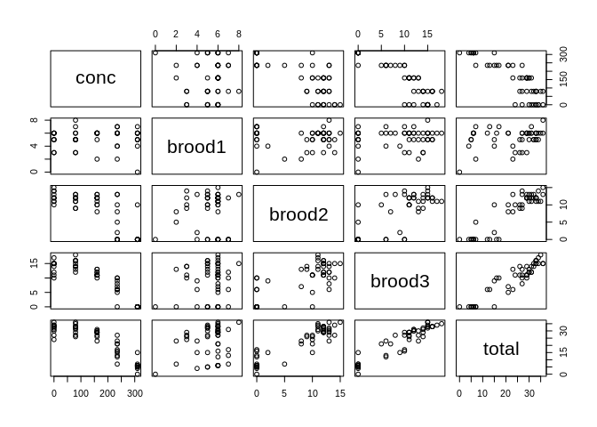

Read CSV
--------

    nitrofen <- read.csv("nitrofen.csv", row.names=1)
    print(nitrofen)

    ##    conc brood1 brood2 brood3 total
    ## 1     0      3     14     10    27
    ## 2     0      5     12     15    32
    ## 3     0      6     11     17    34
    ## 4     0      6     12     15    33
    ## 5     0      6     15     15    36
    ## 6     0      5     14     15    34
    ## 7     0      6     12     15    33
    ## 8     0      5     13     12    30
    ## 9     0      3     10     11    24
    ## 10    0      6     11     14    31
    ## 11   80      6     11     16    33
    ## 12   80      5     12     16    33
    ## 13   80      6     11     18    35
    ## 14   80      5     12     16    33
    ## 15   80      8     13     15    36
    ## 16   80      3      9     14    26
    ## 17   80      5      9     13    27
    ## 18   80      7     12     12    31
    ## 19   80      5     13     14    32
    ## 20   80      3     12     14    29
    ## 21  160      6     12     11    29
    ## 22  160      6     12     11    29
    ## 23  160      2      8     13    23
    ## 24  160      6     10     11    27
    ## 25  160      6     11     13    30
    ## 26  160      6     13     12    31
    ## 27  160      6     12     12    30
    ## 28  160      5     10     11    26
    ## 29  160      6     13     10    29
    ## 30  160      6     12     11    29
    ## 31  235      4     13      6    23
    ## 32  235      6     10      5    21
    ## 33  235      2      5      0     7
    ## 34  235      6      0      6    12
    ## 35  235      6     13      8    27
    ## 36  235      6      0     10    16
    ## 37  235      7      0      6    13
    ## 38  235      4      2      9    15
    ## 39  235      6      8      7    21
    ## 40  235      7      0     10    17
    ## 41  310      6      0      0     6
    ## 42  310      6      0      0     6
    ## 43  310      7      0      0     7
    ## 44  310      0      0      0     0
    ## 45  310      5     10      0    15
    ## 46  310      5      0      0     5
    ## 47  310      6      0      0     6
    ## 48  310      4      0      0     4
    ## 49  310      6      0      0     6
    ## 50  310      5      0      0     5

Attach
------

    attach(nitrofen)

Scatter Plot
------------

    plot(nitrofen)

Summary data
------------

    nitrofen.summary <- function(x) {   c(Min = min(x),
                                        SD = sd(x),
                                        Q1 = quantile(x, 0.25),
                                        IQR = IQR(x),
                                        Mean = mean(x),
                                        Med = median(x),
                                        Q3 = quantile(x, 0.75),
                                        Max = max(x),
                                        Range = (range(x)[2] - range(x)[1]),
                                        Var = var(x),
                                        Len = length(x) )
    }
    sapply(nitrofen, nitrofen.summary)

    ##              conc    brood1    brood2    brood3     total
    ## Min        0.0000  0.000000  0.000000  0.000000   0.00000
    ## SD       110.7304  1.482001  5.370213  5.806014  10.72407
    ## Q1.25%    80.0000  5.000000  0.500000  6.000000  15.00000
    ## IQR      155.0000  1.000000 11.500000  8.000000  16.00000
    ## Mean     157.0000  5.260000  8.240000  9.380000  22.88000
    ## Med      160.0000  6.000000 11.000000 11.000000  27.00000
    ## Q3.75%   235.0000  6.000000 12.000000 14.000000  31.00000
    ## Max      310.0000  8.000000 15.000000 18.000000  36.00000
    ## Range    310.0000  8.000000 15.000000 18.000000  36.00000
    ## Var    12261.2245  2.196327 28.839184 33.709796 115.00571
    ## Len       50.0000 50.000000 50.000000 50.000000  50.00000

Plot conc ~ total
-----------------

    plot(conc ~ total, col=conc)
    lines(loess.smooth(total, conc))

