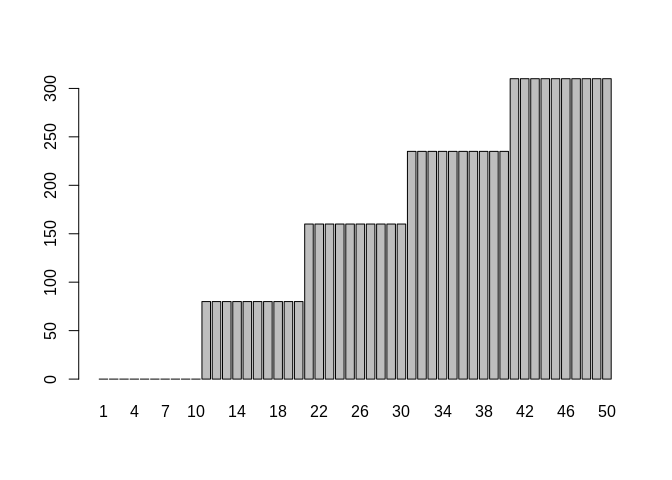
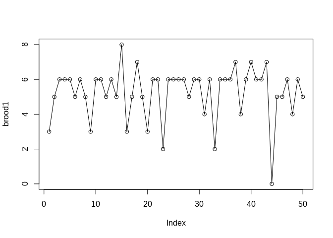
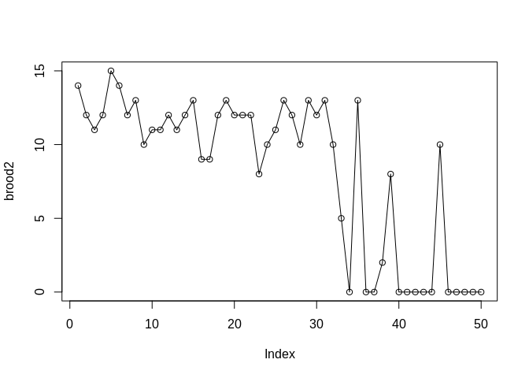
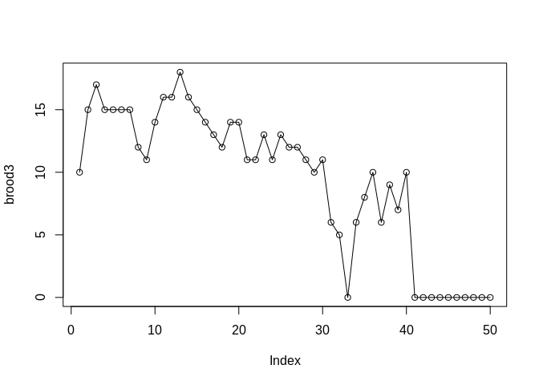
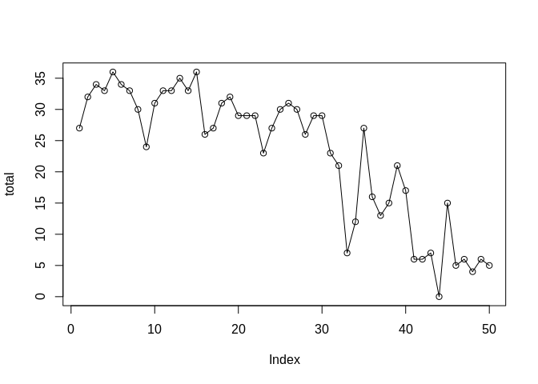
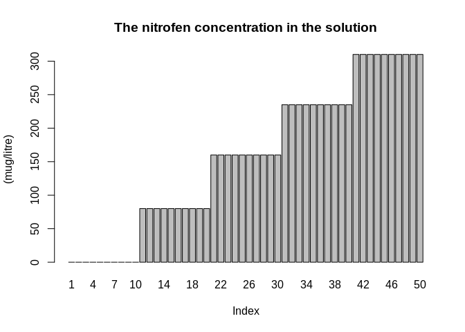
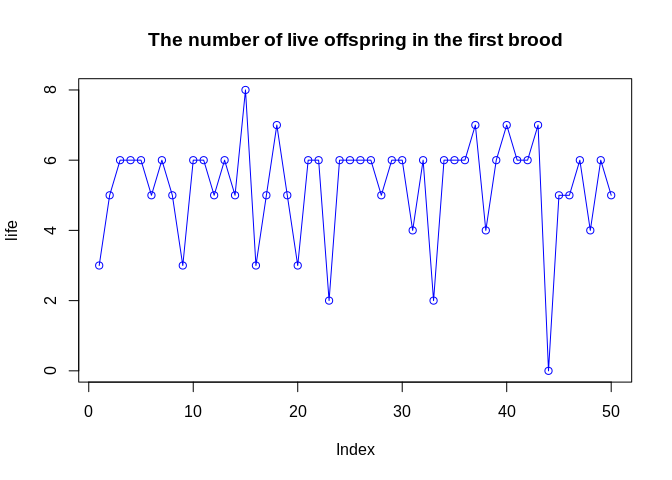
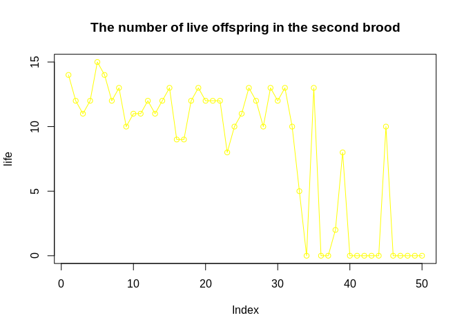
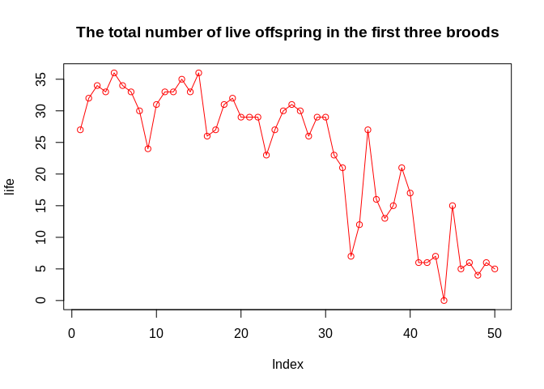

Toxicity of Nitrofen in Aquatic Systems
=======================================

        Nitrofen is a herbicide that was used extensively for the control of broad-leaved and grass weeds in cereals and rice. Although it is relatively non-toxic to adult mammals, nitrofen is a significant tetragen and mutagen. It is also acutely toxic and reproductively toxic to cladoceran zooplankton. Nitrofen is no longer in commercial use in the U.S., having been the first pesticide to be withdrawn due to tetragenic effects.

        The data here come from an experiment to measure the reproductive toxicity of nitrofen on a species of zooplankton. 50 animals were randomized into batches of 10 and each batch was put in a solution with a measured concentration of nitrofen. Then the number of live offspring in each of the three broods to each animal was recorded.

Format
------

### conc

-   The nitrofen concentration in the solution (mug/litre).

### brood1

-   The number of live offspring in the first brood.

### brood2

-   The number of live offspring in the second brood.

### brood3

-   The number of live offspring in the third brood.

### total

-   The total number of live offspring in the first three broods. \`\`\`

Read CSV
--------

    nitrofen <- read.csv("nitrofen.csv", row.names=1)

RAW Data
--------

    print(nitrofen)

    ##    conc brood1 brood2 brood3 total
    ## 1     0      3     14     10    27
    ## 2     0      5     12     15    32
    ## 3     0      6     11     17    34
    ## 4     0      6     12     15    33
    ## 5     0      6     15     15    36
    ## 6     0      5     14     15    34
    ## 7     0      6     12     15    33
    ## 8     0      5     13     12    30
    ## 9     0      3     10     11    24
    ## 10    0      6     11     14    31
    ## 11   80      6     11     16    33
    ## 12   80      5     12     16    33
    ## 13   80      6     11     18    35
    ## 14   80      5     12     16    33
    ## 15   80      8     13     15    36
    ## 16   80      3      9     14    26
    ## 17   80      5      9     13    27
    ## 18   80      7     12     12    31
    ## 19   80      5     13     14    32
    ## 20   80      3     12     14    29
    ## 21  160      6     12     11    29
    ## 22  160      6     12     11    29
    ## 23  160      2      8     13    23
    ## 24  160      6     10     11    27
    ## 25  160      6     11     13    30
    ## 26  160      6     13     12    31
    ## 27  160      6     12     12    30
    ## 28  160      5     10     11    26
    ## 29  160      6     13     10    29
    ## 30  160      6     12     11    29
    ## 31  235      4     13      6    23
    ## 32  235      6     10      5    21
    ## 33  235      2      5      0     7
    ## 34  235      6      0      6    12
    ## 35  235      6     13      8    27
    ## 36  235      6      0     10    16
    ## 37  235      7      0      6    13
    ## 38  235      4      2      9    15
    ## 39  235      6      8      7    21
    ## 40  235      7      0     10    17
    ## 41  310      6      0      0     6
    ## 42  310      6      0      0     6
    ## 43  310      7      0      0     7
    ## 44  310      0      0      0     0
    ## 45  310      5     10      0    15
    ## 46  310      5      0      0     5
    ## 47  310      6      0      0     6
    ## 48  310      4      0      0     4
    ## 49  310      6      0      0     6
    ## 50  310      5      0      0     5

Attach
------

    attach(nitrofen)

Scatter Plot All
----------------

    barplot(conc,names.arg = c(1:50))

    plot(brood1, type='o')

    plot(brood2, type='o')

    plot(brood3, type='o')

    plot(total, type='o')

Scatter Plot dependent variable
-------------------------------

    plot(total, type='o', col='red')
    lines(brood1, type = "o", col='blue')
    lines(brood2, type = "o", col='yellow')
    lines(brood3, type = "o", col='green')

Box Plot
--------

    boxplot(nitrofen[2:5])

Hist
----

    hist(total)

Summary Data
------------

    nitrofen.summary <- function(x) {   c(Min = min(x),
                                        SD = sd(x),
                                        Q1 = quantile(x, 0.25),
                                        IQR = IQR(x),
                                        Mean = mean(x),
                                        Med = median(x),
                                        Q3 = quantile(x, 0.75),
                                        Max = max(x),
                                        Range = (range(x)[2] - range(x)[1]),
                                        Var = var(x),
                                        Len = length(x) )
    }
    sapply(nitrofen, nitrofen.summary)

    ##              conc    brood1    brood2    brood3     total
    ## Min        0.0000  0.000000  0.000000  0.000000   0.00000
    ## SD       110.7304  1.482001  5.370213  5.806014  10.72407
    ## Q1.25%    80.0000  5.000000  0.500000  6.000000  15.00000
    ## IQR      155.0000  1.000000 11.500000  8.000000  16.00000
    ## Mean     157.0000  5.260000  8.240000  9.380000  22.88000
    ## Med      160.0000  6.000000 11.000000 11.000000  27.00000
    ## Q3.75%   235.0000  6.000000 12.000000 14.000000  31.00000
    ## Max      310.0000  8.000000 15.000000 18.000000  36.00000
    ## Range    310.0000  8.000000 15.000000 18.000000  36.00000
    ## Var    12261.2245  2.196327 28.839184 33.709796 115.00571
    ## Len       50.0000 50.000000 50.000000 50.000000  50.00000

Plot conc ~ total
-----------------

    rela <- lm(total ~ conc)
    summary(rela)

    ## 
    ## Call:
    ## lm(formula = total ~ conc)
    ## 
    ## Residuals:
    ##      Min       1Q   Median       3Q      Max 
    ## -11.9741  -4.1195  -0.3383   4.6254  10.6254 
    ## 
    ## Coefficients:
    ##              Estimate Std. Error t value Pr(>|t|)    
    ## (Intercept) 35.974134   1.360648   26.44  < 2e-16 ***
    ## conc        -0.083402   0.007106  -11.74 1.04e-15 ***
    ## ---
    ## Signif. codes:  0 '***' 0.001 '**' 0.01 '*' 0.05 '.' 0.1 ' ' 1
    ## 
    ## Residual standard error: 5.508 on 48 degrees of freedom
    ## Multiple R-squared:  0.7416, Adjusted R-squared:  0.7362 
    ## F-statistic: 137.8 on 1 and 48 DF,  p-value: 1.038e-15

    plot(total ~ conc, col=conc)
    abline(rela)

